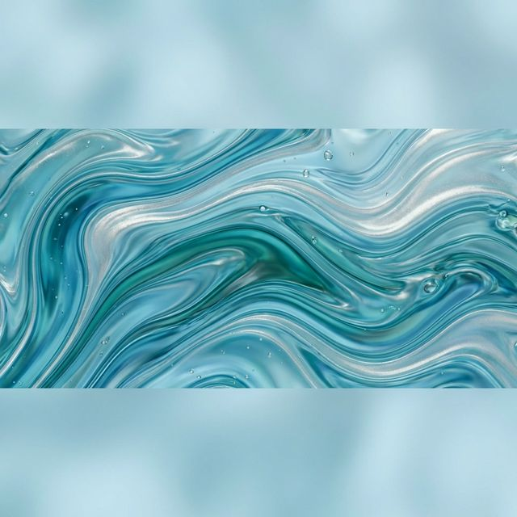

# 🌊 FluidArt - Portfolio Website

> **A stunning, responsive portfolio website inspired by the fluidity and organic beauty of water.**



---

## ✨ Overview

**FluidArt** is a modern, elegant portfolio website that showcases fluid-inspired art pieces. Built with clean HTML5/CSS3, it features a minimalist design with smooth animations, responsive layouts, and an intuitive user experience that adapts seamlessly across all devices.

---

## 🎯 Features

### 🎨 **Modern Design**
- **Fluid Aesthetics**: Dark, sophisticated color palette with gradient effects
- **Glassmorphism**: Subtle glass-like card designs
- **Smooth Animations**: Hover effects and smooth transitions throughout
- **Typography**: Google Fonts (Montserrat + Open Sans) for premium look

### 📱 **Fully Responsive**
- **Desktop-First**: Optimized for large screens
- **Tablet Support**: 2-column grid layout (768px breakpoint)
- **Mobile Optimized**: Single-column layout (480px breakpoint)
- **Accessibility**: Reduced motion preference support

### 🧩 **Key Sections**
1. **Hero Section** - Eye-catching gradient banner
2. **Gallery** - 9 featured artworks in responsive grid
3. **Call-to-Action** - Engaging discovery prompt
4. **About** - Artist's philosophy and statement
5. **Services** - Comprehensive service offerings
6. **Testimonials** - Customer reviews in card layout
7. **Footer** - Contact button and copyright info

---

## 🚀 Quick Start

### Prerequisites
- A modern web browser (Chrome, Firefox, Safari, Edge)
- No build tools or dependencies required!

### Installation

1. **Clone or Download** this repository:
   ```bash
   git clone <repository-url>
   cd 6-Capstone_project-1
   ```

2. **Open in Browser**:
   ```bash
   open index.html
   # or simply double-click index.html
   ```

That's it! The website is 100% static HTML/CSS with no external dependencies.

---

## 📁 Project Structure

```
6-Capstone_project-1/
│
├── index.html          # Main HTML file (228 lines)
├── style.css           # Complete stylesheet (458 lines)
├── README.md           # This file
│
└── img/               # Image assets (11 WebP images)
    ├── hero_banner.webp
    ├── oceanic_waves.webp
    ├── liquid_dreams.webp
    ├── gentle_tides.webp
    ├── subtle_streams.webp
    ├── fluid_reflections.webp
    ├── water_whispers.webp
    ├── flowing_serenity.webp
    ├── ethereal_ripples.webp
    ├── calm_currents.webp
    └── about_background.webp
```

---

## 🎨 Design System

### Color Palette
```css
--primary-dark:    #1A1A2E   /* Deep navy */
--primary-color:   #16213E   /* Dark blue */
--secondary-color: #0F3460   /* Ocean blue */
--accent-color:    #533483   /* Purple accent */
--light-accent:    #E94560   /* Coral pink */
```

### Typography
- **Headings**: Montserrat (400, 500, 600, 700)
- **Body**: Open Sans (300, 400, 500)

### Spacing System
```css
--space-xs:  0.25rem  /* 4px */
--space-sm:  0.5rem   /* 8px */
--space-md:  1rem     /* 16px */
--space-lg:  1.5rem   /* 24px */
--space-xl:  2rem     /* 32px */
--space-2xl: 3rem     /* 48px */
--space-3xl: 4rem     /* 64px */
```

---

## 📱 Responsive Breakpoints

| Device | Breakpoint | Grid Columns |
|--------|-----------|--------------|
| **Desktop** | > 768px | 3 columns |
| **Tablet** | ≤ 768px | 2 columns |
| **Mobile** | ≤ 480px | 1 column |

---

## 🌟 Key Highlights

### Performance
- ✅ **Lightweight**: No JavaScript required
- ✅ **Fast Loading**: Optimized WebP images
- ✅ **SEO-Friendly**: Semantic HTML5 structure
- ✅ **Accessible**: ARIA-compliant, reduced motion support

### Modern CSS Features
- CSS Custom Properties (Variables)
- CSS Grid & Flexbox layouts
- Smooth scroll behavior
- Advanced hover effects
- Gradient backgrounds

---

## 🛠️ Customization

### Change Colors
Edit the `:root` variables in `style.css`:
```css
:root {
    --primary-color: #YourColor;
    --accent-color: #YourAccent;
}
```

### Add Gallery Items
In `index.html`, duplicate a gallery item:
```html
<div class="gallery-item">
    <div class="gallery-image">
        
    </div>
    <div class="gallery-content">
        <h3 class="gallery-title">Your Title</h3>
        <p class="gallery-category">Category</p>
    </div>
</div>
```

### Modify Services
Update the services lists in the Services Section of `index.html`.

---

## 🎯 Use Cases

This template is perfect for:
- 🎨 **Artists & Designers** - Portfolio showcase
- 📸 **Photographers** - Image gallery presentation
- 🖼️ **Creatives** - Personal branding site
- 🎭 **Visual Artists** - Work exhibitions
- 🌊 **Nature Enthusiasts** - Themed content sites

---

## 🔮 Future Enhancements

- [ ] Add lightbox modal for gallery images
- [ ] Implement contact form functionality
- [ ] Add smooth scroll animations (AOS library)
- [ ] Create filtering system for gallery
- [ ] Add dark/light theme toggle
- [ ] Integrate CMS for easy content updates

---

## 📄 License

This project is open source and available for personal and commercial use.

---

## 👨‍💻 Author

**Developed with 💙 for the art community**

- **Project Type**: Capstone Project
- **Academic**: Semester 3 Learning Project
- **Focus**: Responsive Web Design & Modern CSS

---

## 🙏 Acknowledgments

- **Images**: Unsplash & Custom WebP assets
- **Fonts**: Google Fonts (Montserrat, Open Sans)
- **Inspiration**: Fluid art & water motion aesthetics

---

<div align="center">

### ⭐ If you found this helpful, please consider giving it a star!

**Made with ❤️ and a passion for clean, beautiful web design**

</div>